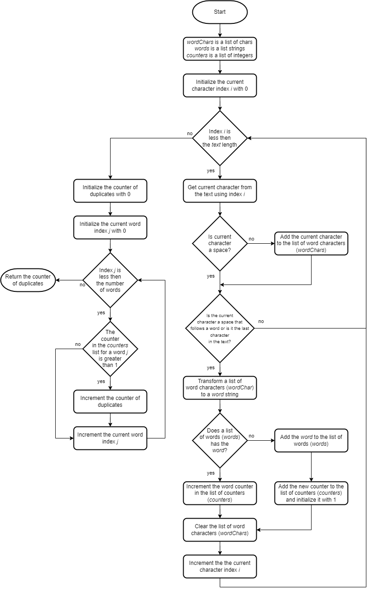
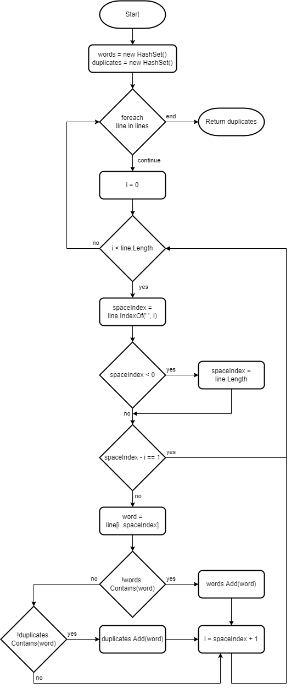

# Duplicate Words

An intermediate level task for practicing algorithms, loops, collections and work with strings.

Estimated time to complete the task - 2h.

The task requires .NET 6 SDK installed.


## Task Description

In this task you have to implement six static methods that process a text and searches strings for duplicate words.


### 1. List Collection

Implement the [CountDuplicateWords](DuplicateWords/TextProcessor.cs#L12) method to return the number of words that are duplicated in the `text` argument. Use the [List&lt;T&gt;](https://docs.microsoft.com/en-us/dotnet/api/system.collections.generic.list-1) class for storing the word list, the list of characters and the list of counters.

```
"aaa bbb ccc" => 0
"aaa bbb ccc aaa" => 1
"aaa bbb ccc aaa bbb ccc" => 3
```



1. Initialize the lists and return a zero as a temporary value.

```cs
public static int CountDuplicateWords(string text)
{
    List<char> wordChars = new ();
    List<string> words = new ();
    List<int> counters = new ();

    return 0;
}
```

When instantiating an object with the `new` operator you can [omit a type name](https://docs.microsoft.com/en-us/dotnet/csharp/language-reference/operators/new-operator), if a target type of an expression in known.

2. Add the `for` loop to iterate over the characters in the `text` argument.

```cs
public static int CountDuplicateWords(string text)
{
    List<char> wordChars = new ();
    List<string> words = new ();
    List<int> counters = new ();

    // Process characters in the "text" argument one by one.
    for (int i = 0; i < text.Length; i++)
    {
    }

    return 0;
}
```

3. Add a selection statement to add a current character to `wordChars` list, if the current character is not the white-space character.

```cs
// Process characters in the "text" argument one by one.
for (int i = 0; i < text.Length; i++)
{
    char c = text[i];
    bool isSpace = c == ' ';

    // If a character is not the white-space character, add the character to the list of word characters.
    if (!isSpace)
    {
        wordChars.Add(c);
    }
}
```

4. Add a selection statement to check whether the current character is a white-space that follows a word or the end of the `text` is reached.

```cs
// Process characters in the "text" argument one by one.
for (int i = 0; i < text.Length; i++)
{
    char c = text[i];
    bool isSpace = c == ' ';

    // If a character is not the white-space character, add the character to the list of word characters.
    if (!isSpace)
    {
        wordChars.Add(c);
    }

    bool isSpaceAfterWord = isSpace && wordChars.Count > 0;
    bool isLastChar = !isSpace && i == text.Length - 1;

    // If a character is a white-space that follows a word or the end of string is reached, process the list of word characters.
    if (isSpaceAfterWord || isLastChar)
    {
    }
}
```

5. Transform the list of word characters to a string.

```cs
// If a character is a white-space that follows a word or the end of string is reached, process the list of word characters.
if (isSpaceAfterWord || isLastChar)
{
    // Transform a list of characters to a word.
    string word = new string(wordChars.ToArray());
}
```

6. Search for a word in the list of words.

```cs
// Search for the word in the list of words.
int wordIndex = words.IndexOf(word);
```

7. Clean the list of word characters.

```cs
// Clear the characters list.
wordChars.Clear();
```

8. Add a selection statement to add the word to the word list

```cs
// If a character is a white-space that follows a word or the end of string is reached, process the list of word characters.
if (isSpaceAfterWord || isLastChar)
{
    // Transform a list of characters to a word.
    string word = new string(wordChars.ToArray());

    // Search for the word in the list of words.
    int wordIndex = words.IndexOf(word);

    // If a word is not in the list of words, that means it is the first occurrence of the word in the text.
    if (wordIndex < 0)
    {
        // Add the word to the list of words.
        words.Add(word);
    }

    // Clear the characters list.
    wordChars.Clear();
}
```

9. Add a new word counter to the list of counters and initialize it with "1".

```cs
// If a word is not in the list of words, that means it is the first occurrence of the word in the text.
if (wordIndex < 0)
{
    // Add the word to the list of words.
    words.Add(word);

    // Add the counter to the list of counter; each word has a counter attached to it.
    counters.Add(1);
}
```

10. If the word is in the list of words already, increase the word counter for the word found in the word list.

```cs
else
{
    // Increase the counter of occurrences for the word that is found in the list of words.
    counters[wordIndex] = counters[wordIndex] + 1;
}
```

11. Initialize a duplicate counter with 0 and return the counter from the method.

```cs
// Initialize a duplicate word counter.
int duplicateCounter = 0;

return duplicateCounter;
```

12. Add a `for` loop to iterate over the word list.

```cs
// Iterate over all words in the word list and increase the duplicate word counter each time when a word with many occurrences is met.
for (int j = 0; j < words.Count; j++)
{
}
```

13. Increment the duplicate counter each time when a counter for a current word is greater then 1.

```cs
// Iterate over all words in the word list and increase the duplicate word counter each time when a word with many occurrences is met.
for (int j = 0; j < words.Count; j++)
{
    if (counters[j] > 1)
    {
        duplicateCounter++;
    }
}
```

You may notice that there are few comments in the code about. Read the [best practices for code documentation](https://www.google.com/search?q=best+practices+code+comments), and analyze the method code again. What comments are useful and what aren't?


### 2. Dictionary Collection

Implement the [GetTotalDuplicateWordsNumber](DuplicateWords/TextProcessor.cs#L23) method to return the total number of all words that are duplicated in the `lines` list. A line may contain a single word or a few words separated with the white-space character (' ').

```
"aaa bbb aaa" => 2
"aaa bbb aaa bbb" => 4
"aaa bbb ccc bbb ccc ddd" => 4
```

Use the [Dictionary&lt;TKey, TValue&gt;](https://docs.microsoft.com/en-us/dotnet/api/system.collections.generic.dictionary-2) collection for storing the word list and counters and the [StringBuilder](https://docs.microsoft.com/en-us/dotnet/api/system.text.stringbuilder) class for building a word string. For determining whether a character is a letter or a decimal digit use the [Char.IsLetterOrDigit](https://docs.microsoft.com/en-us/dotnet/api/system.char.isletterordigit) method.

The type of the `lines` parameter is the [IList&lt;T&gt;](https://docs.microsoft.com/en-us/dotnet/api/system.collections.generic.ilist-1). The `IList<T>` interface has [IList&lt;T&gt;.Item[Int32]](https://docs.microsoft.com/en-us/dotnet/api/system.collections.generic.ilist-1.item) property, therefore you can use the `for` statement to iterate through the list.

```cs
for (int i = 0; i < lines.Count; i++)
{
    string line = lines[i];
}
```


### 3. HashSet Collection

Implement the [GetDuplicateWords](DuplicateWords/TextProcessor.cs#L38) method to return the list of words that are duplicated in the `lines` collection. A line may contain a single word or a few words separated with the white-space character (' ').

```
{ "aaa bbb", "bbb ccc" } => { "bbb" }
{ "aaa bbb ccc", "bbb ccc ddd" } => { "bbb", "ccc" }
{ "aaa bbb", "bbb ccc", "ccc ddd" } => { "bbb", "ccc" }
```



Use the [HashSet&lt;T&gt;](https://docs.microsoft.com/en-us/dotnet/api/system.collections.generic.hashset-1) collection for storing words and duplicate words.

The `lines` parameter has the `ICollection<string>?` type. That means the parameter is a [nullable reference type](https://docs.microsoft.com/en-us/dotnet/csharp/nullable-references). Add the [guard clause](https://www.google.com/search?q=guard+clause) to fail in case the `lines` parameter is `null`.

```cs
if (lines is null)
{
    throw new ArgumentNullException(nameof(lines));
}
```

The type of the `lines` parameter is [ICollection&lt;T&gt;](https://docs.microsoft.com/en-us/dotnet/api/system.collections.generic.icollection-1). The `ICollection<T>` interface has no such property as the `IList<T>.Item[Int32]` property, therefore you can iterate over the collection with the `foreach` statement.

```cs
foreach (string line in lines)
{
}
```


### 4. Equality Comparer

Implement the [GetUniqueWords](DuplicateWords/TextProcessor.cs#L54) method to return the collection of unique words from the `lines` enumerable object. The result collection should be sorted applying the word comparison rules of invariant culture to the collection elements.

Example of the method output, if the `ignoreCase` argument is set to 'false':

```
{ "AAA", "AaA", "aAa", "aaa" } => { "aaa", "aAa", "AaA", "AAA" }
{ "aaa", "AaA", "aAa", "AAA" } => { "aaa", "aAa", "AaA", "AAA" }
{ "AAA bbb CCC", "aaa BBB ccc" } => { "aaa", "AAA", "bbb", "BBB", "ccc", "CCC" }
```

Example of the method output, if the `ignoreCase` argument is set to 'true':

```
{ "aaa", "AaA", "aAa", "AAA" } => { }
{ "AAA bbb CCC", "aaa BBB ccc" } => { }
```

Use the `HashSet<T>` collection that is initialized by calling the [HashSet&lt;T&gt;(IEqualityComparer&lt;T&gt;)](https://docs.microsoft.com/en-us/dotnet/api/system.collections.generic.hashset-1.-ctor) constructor with a [StringComparer](https://docs.microsoft.com/en-us/dotnet/api/system.stringcomparer) object as a parameter.

An example of initializing a new instance of the `HashSet<T>` class that uses the specific equality comparer for the set type.

```cs
var hashSet = new HashSet<string>(StringComparer.InvariantCulture);
```

Use the word comparison rules of the invariant culture to make your code culture agnostic.

To split a text call the [String.Split](https://docs.microsoft.com/en-us/dotnet/api/system.string.split) method with the relevant options to omit empty strings and trim white-space characters from each substring.


### 5. String Builder

Implement the [RemoveDuplicateWordsInStringBuilder](DuplicateWords/TextProcessor.cs#L65) method to search a string for duplicates and remove all next occurrences of duplicate words. The first occurrence of a duplicate word should say on it's place. A string may contain a single word or a few words separated by a white-space character (' ').

```cs
"aaa aaa aaa aaa" => "aaa   "
"aaa bbb ccc aaa ccc ddd" => "aaa bbb ccc  ddd"
```


### 6. Case Sensitive Search

Implement the [RemoveDuplicateWordsInString](DuplicateWords/TextProcessor.cs#L80) method to search a string for duplicates and remove all next occurrences of duplicate words. The first occurrence of a duplicate word should say on it's place. A string may contain a single word or a few words separated by a white-space character (' ').

The `text` parameter has `ref` keyword before the parameter type. This keyword indicates that an argument is [passed by reference](https://docs.microsoft.com/en-us/dotnet/csharp/language-reference/keywords/ref#passing-an-argument-by-reference), not by value.

The method has `ignoreCase` flag. If the flag is set to `true` the method should ignore letter's case.


## See also

* [Indices and ranges](https://docs.microsoft.com/en-us/dotnet/csharp/whats-new/tutorials/ranges-indexes)
* C# Language Reference
  * [Selection statements](https://docs.microsoft.com/en-us/dotnet/csharp/language-reference/statements/selection-statements)
  * [Iteration statements](https://docs.microsoft.com/en-us/dotnet/csharp/language-reference/statements/iteration-statements)
  * [new operator](https://docs.microsoft.com/en-us/dotnet/csharp/language-reference/operators/new-operator)
  * [Nullable reference types](https://docs.microsoft.com/en-us/dotnet/csharp/nullable-references)
  * [Passing an argument by reference](https://docs.microsoft.com/en-us/dotnet/csharp/language-reference/keywords/ref#passing-an-argument-by-reference)
* .NET API
  * [List&lt;T&gt; Class](https://docs.microsoft.com/en-us/dotnet/api/system.collections.generic.list-1)
  * [Dictionary&lt;TKey, TValue&gt; Class](https://docs.microsoft.com/en-us/dotnet/api/system.collections.generic.dictionary-2)
  * [HashSet&lt;T&gt; Class](https://docs.microsoft.com/en-us/dotnet/api/system.collections.generic.hashset-1)
  * [String Class](https://docs.microsoft.com/en-us/dotnet/api/system.string)
  * [StringBuilder Class](https://docs.microsoft.com/en-us/dotnet/api/system.text.stringbuilder)
  * [Char Struct](https://docs.microsoft.com/en-us/dotnet/api/system.char)
  * [String Comparer](https://docs.microsoft.com/en-us/dotnet/api/system.stringcomparer)
  * [ICollection&lt;T&gt; Interface](https://docs.microsoft.com/en-us/dotnet/api/system.collections.icollection)
  * [IList&lt;T&gt; Interface](https://docs.microsoft.com/en-us/dotnet/api/system.collections.generic.ilist-1)
